# 🏫 School Management System

A complete web-based school management system built with **PHP OOP**, **MySQL**, and **Bootstrap 5**, designed for Moroccan high schools (*Lycée*). All user-facing content is in **French**.


---
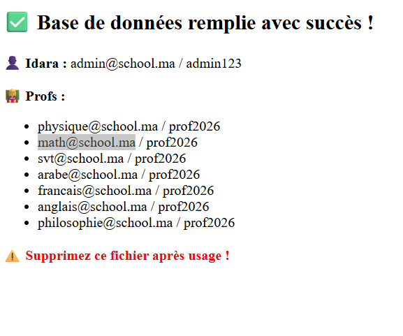
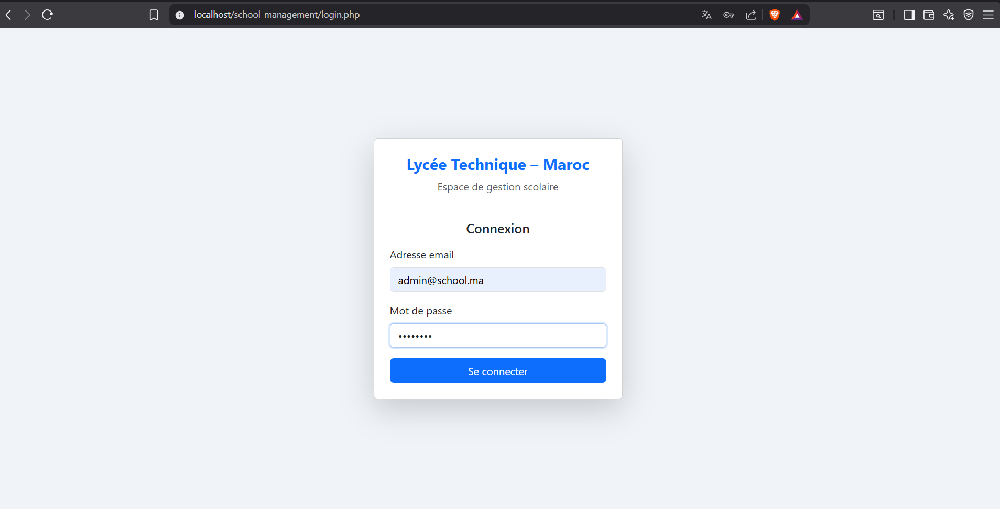 
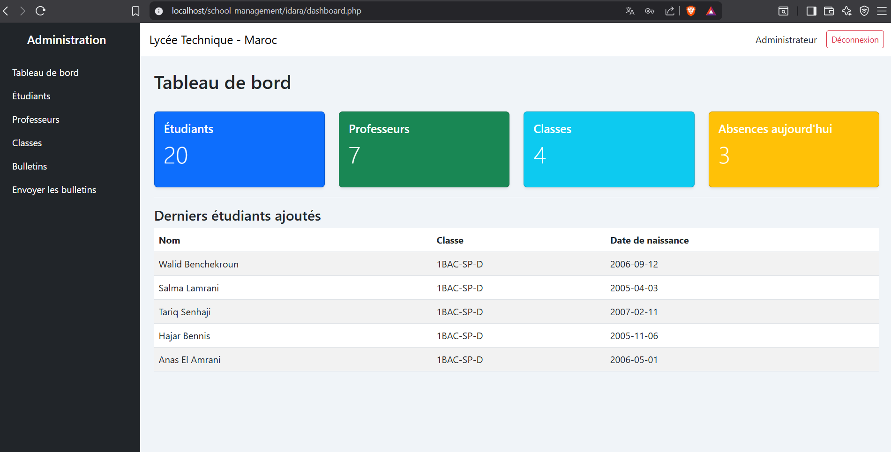 
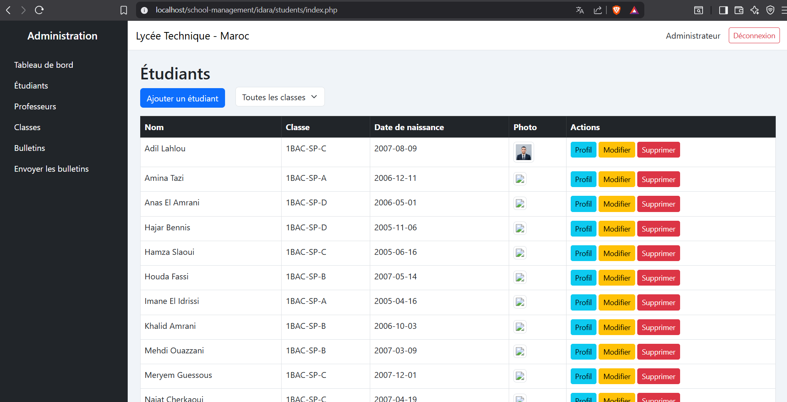 
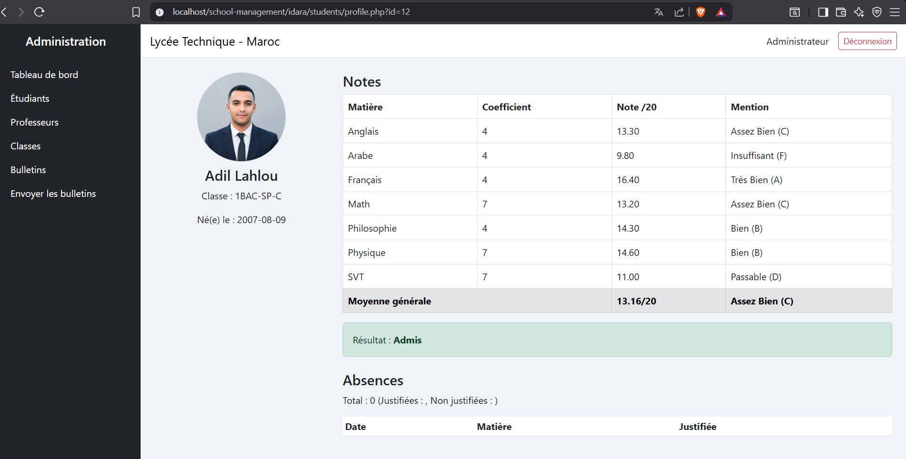 


[View Bulletin PDF](imgs/bulletin_Hamza%20Slaoui.pdf) 


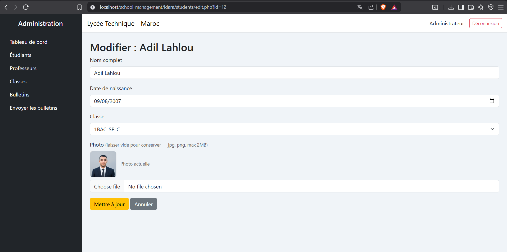 
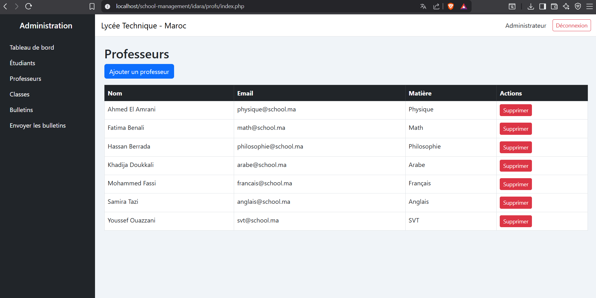 
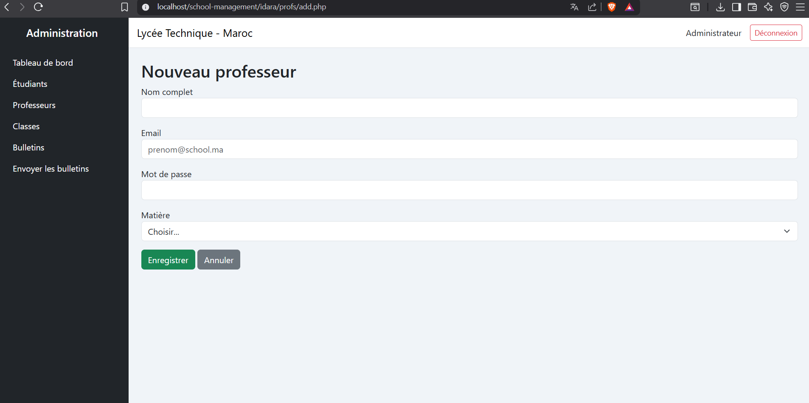 
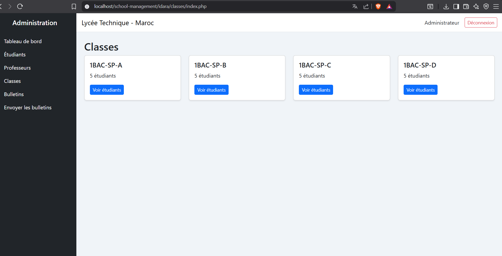 
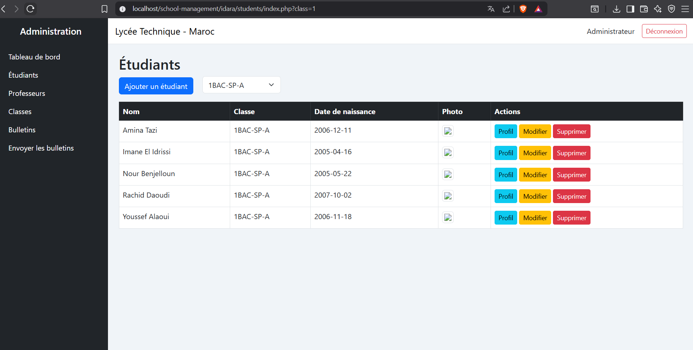 
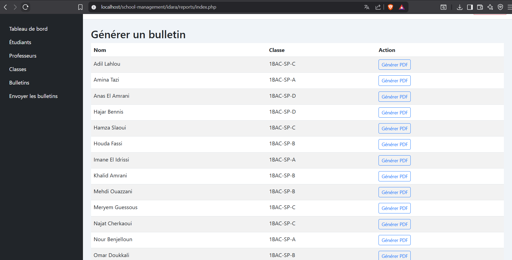 
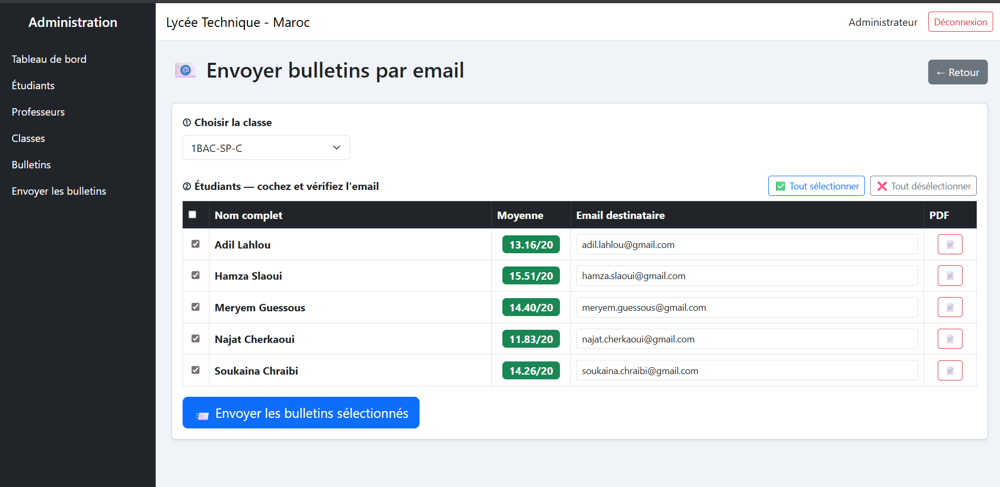 
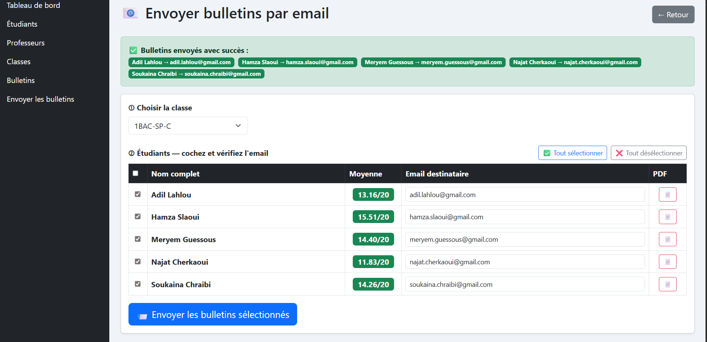 
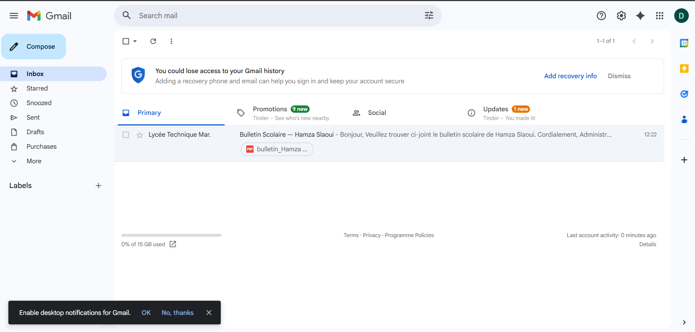 
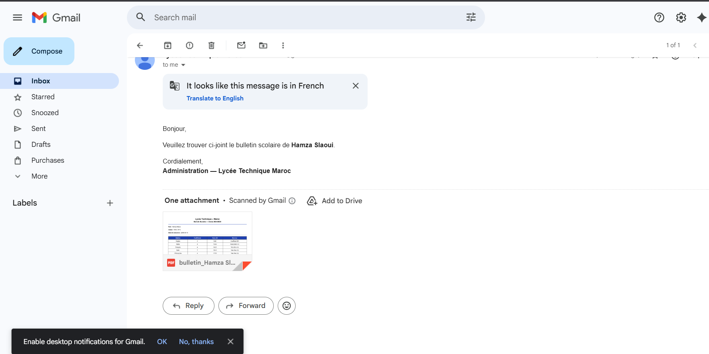 
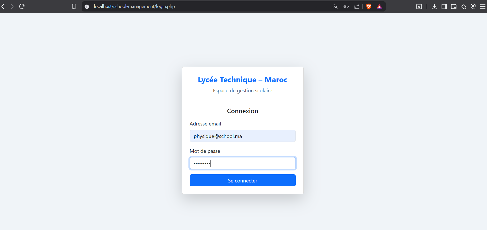 
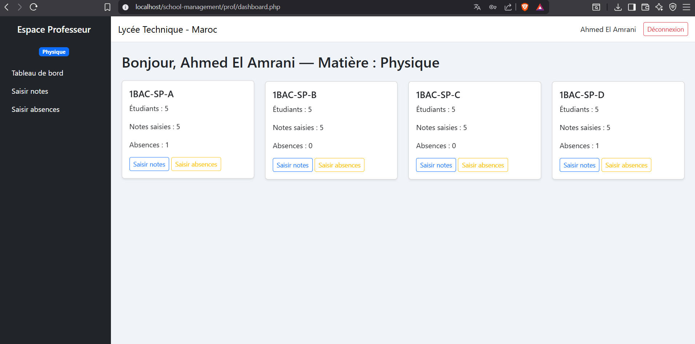 
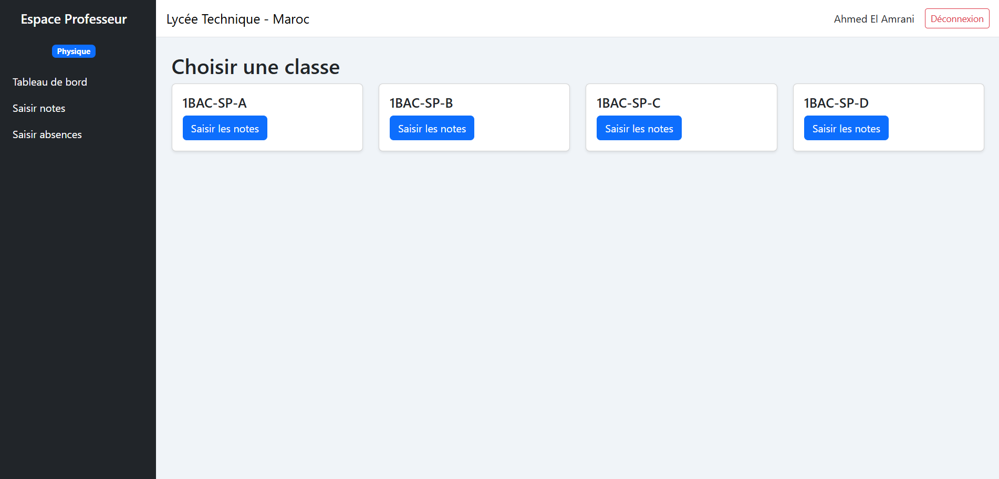 
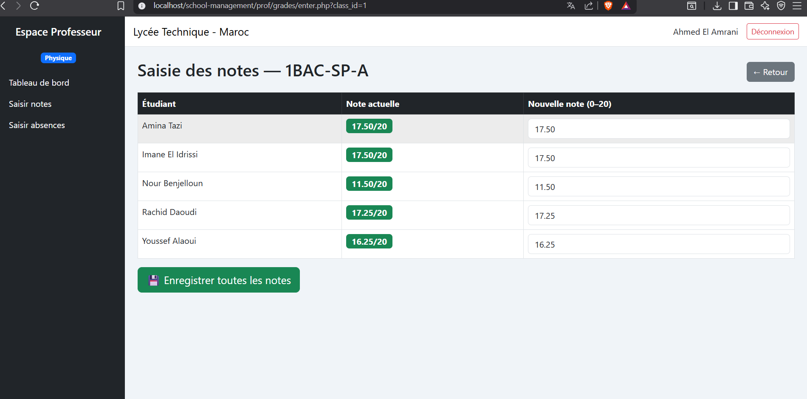 
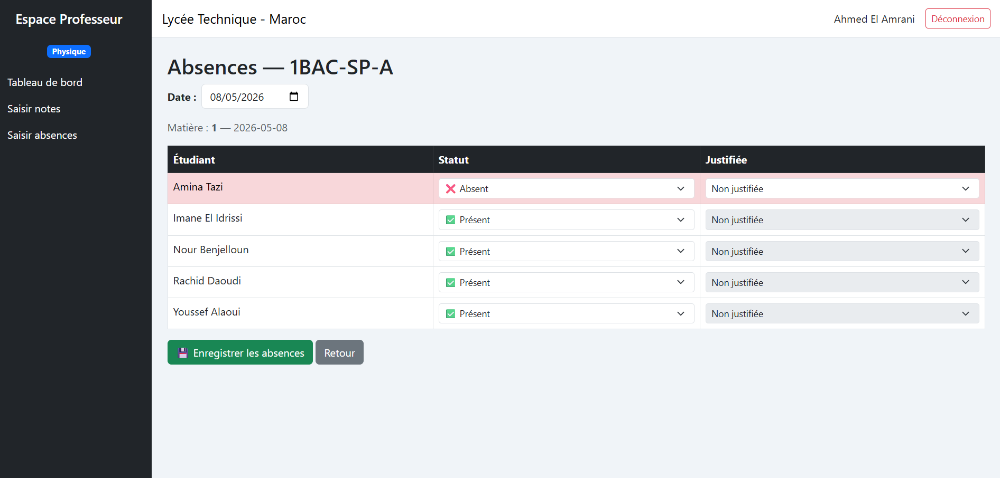 


## ✨ Features

### 👤 Two Roles

| Role | Access |
|------|--------|
| **Idara** (Admin) | Full access — manage students, teachers, classes, generate PDF bulletins, send emails |
| **Prof** (Teacher) | Restricted — enter grades & absences for their subject only |

### 📚 Subjects (1BAC Science Physique)

| Subject | Coefficient | Type |
|---------|-------------|------|
| Physique | 7 | Scientifique |
| Math | 7 | Scientifique |
| SVT | 7 | Scientifique |
| Arabe | 4 | Littéraire |
| Français | 4 | Littéraire |
| Anglais | 4 | Littéraire |
| Philosophie | 4 | Littéraire |

### 🧮 Weighted Average
```
Moyenne = Σ(note × coefficient) / 37
```

### ✅ Key Features
- Student CRUD with photo upload
- Grade entry per subject per class
- Absence tracking (justified / not justified)
- Weighted average calculation
- Student profile with full report
- PDF bulletin generation (DOMPDF)
- Email sending with PDF attachment (PHPMailer)
- Role-based access control
- Responsive Bootstrap 5 UI

---

## 🛠️ Tech Stack

| Layer | Technology |
|-------|-----------|
| Backend | PHP 8+ OOP + PDO |
| Database | MySQL 8 |
| Frontend | Bootstrap 5.3 |
| PDF | DOMPDF |
| Email | PHPMailer |
| Auth | PHP Sessions |

---

## 📁 Project Structure

```
school-management/
├── config.php
├── login.php
├── logout.php
├── index.php
├── seeder.php
├── classes/
│   ├── Database.php
│   ├── User.php
│   ├── Student.php
│   ├── Grade.php
│   ├── Absence.php
│   └── Subject.php
├── includes/
│   ├── header.php
│   ├── footer.php
│   ├── sidebar-idara.php
│   ├── sidebar-prof.php
│   └── auth_check.php
├── idara/
│   ├── dashboard.php
│   ├── students/
│   ├── profs/
│   ├── classes/
│   └── reports/
├── prof/
│   ├── dashboard.php
│   ├── grades/
│   └── attendance/
├── uploads/students/
├── assets/
└── vendor/
```

---

## 🗄️ Database Schema

```sql
subjects    → id, name, coefficient, type
users       → id, full_name, email, password, role, subject_id
classes     → id, name
students    → id, full_name, date_naissance, photo, class_id
grades      → id, student_id, subject_id, prof_id, note, date
absences    → id, student_id, subject_id, date, justified
```

---

## 🚀 Installation

**1. Clone the repo**
```bash
git clone https://github.com/your-username/school-management.git
```

**2. Move to XAMPP htdocs**
```
C:/xampp/htdocs/school-management
```

**3. Create database**

Open phpMyAdmin → run the SQL from `database.sql`

**4. Configure**

Edit `config.php`:
```php
define('DB_HOST', 'localhost');
define('DB_NAME', 'school_management');
define('DB_USER', 'root');
define('DB_PASS', '');
define('BASE_URL', 'http://localhost/school-management/');
```

**5. Install dependencies**
```bash
composer install
```

**6. Run seeder**
```
http://localhost/school-management/seeder.php
```
> ⚠️ Delete `seeder.php` after running!

**7. Open the app**
```
http://localhost/school-management/
```

---

## 🔐 Default Credentials

| Role | Email | Password |
|------|-------|----------|
| **Idara** | admin@school.ma | admin123 |
| **Prof Physique** | physique@school.ma | prof2026 |
| **Prof Math** | math@school.ma | prof2026 |
| **Prof SVT** | svt@school.ma | prof2026 |
| **Prof Arabe** | arabe@school.ma | prof2026 |
| **Prof Français** | francais@school.ma | prof2026 |
| **Prof Anglais** | anglais@school.ma | prof2026 |
| **Prof Philosophie** | philosophie@school.ma | prof2026 |

---

## 📧 Email Setup (PHPMailer + Gmail)

Edit `idara/reports/send-email.php`:
```php
$mail->Username = 'your.email@gmail.com';
$mail->Password = 'your-gmail-app-password';
```

> Get App Password: Google Account → Security → 2-Step Verification → App Passwords

---

## 🔒 Security
- PDO prepared statements (SQL injection protection)
- `password_hash()` / `password_verify()`
- `htmlspecialchars()` on all output
- Session role check on every protected page

---

## 👨‍💻 Author

Built while learning **PHP OOP + MySQL + Bootstrap 5** 🚀

---

## 📄 License

MIT License